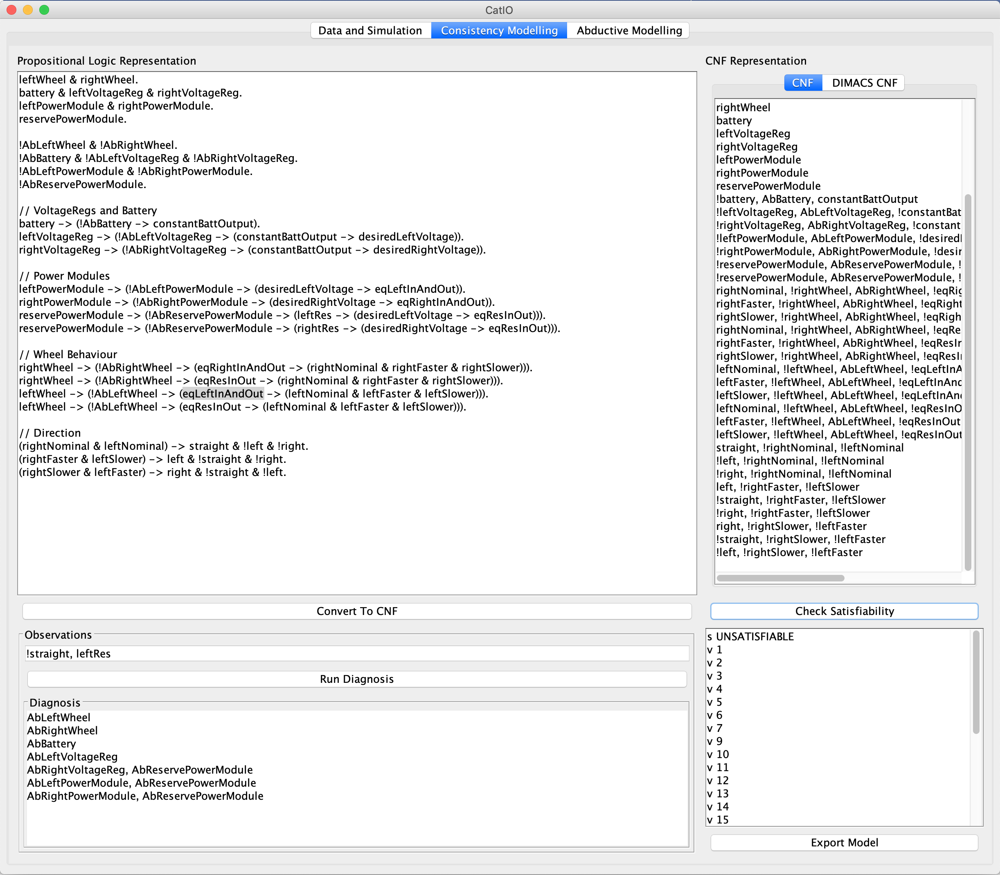

# Framework for model based diagnosis
Framework for creating models for diagnosis, as well as testing their quality using co-simulation. 
Basic documentation with use examples is shown in this readme.

# Interaction with FMIs
FMI can either be standard test benches of form
```
model Testbench
    SUT sys;
equation
    if(time < t1) then 
        ....  // First inputs
    elsif (time >= t1andtime < t2) then 
        .... // Next inputs
    elsif 
        ....
    else
        ....
    end if;
end Testbench;
```
or input oriented models of form
```
model SUT
    input FaultTypeConnector modeAssigmenent_1;
    ...
    input FaultTypeConnector modeAssigmenent_n;
    RealInput modelRealValue_1;
    ...
    BooleanInput modelBooleanValue_1;
equation
    ...
end SUT;
```
Once test becnh or input model is created, its pathname is passed as 
```
public FmiMonitor(String pathToFmi);
```
to class FmiMonitor, which will read defined values from the running simulation.
If test bench with no inputs is given, diagnosis can be run directly on it, as test bench creates a simulation on the SUT.
If input oriented model is given, simulations need to be created in the framework and passed to diagnosis drivers. 

## Component
Component is a data class representing each component in modelica model, and it consist of name, type and value.
```java
public class Component {
    private String name;
    private Type type;
    private Object value;

    public Component(String name, Type type);  
}

public enum Type {
    STRING,
    BOOLEAN,
    DOUBLE,
    INTEGER,
    ENUM
}
```

## ModelData
Model is described in data class ModelData.
Each model consist of 
* Components which are going to be read during simulation
* Mode Assigment Variables
* Parameters of the model
* Inputs of the model

GUI form FmiDataExtractor can be used for easier extraction of data.
If values are provided to mode assigment variables, parameters and inputs mixed level covering array can be created for the model and used for automatic generation of abductive model.

## Simulation form
Simulation scenario is a Map<Integer, List<Component>>, where Integer is time step at which List<Component> values will be written to the simulation.
Scenario has to have key value 0, representing values which will be written at initial step to avoid undefined behaviour.

Simulations can also be created from JSON if form
```json
{
    "scenarioId": "first",
    "timeCompMap": {
      "0": [
        {
          "name": "leftFaultType",
          "type": "ENUM",
          "value": "ok"
        },
        {
          "name": "rightFaultType",
          "type": "ENUM",
          "value": "ok"
        },
        {
          "name": "rightWheelInput",
          "type": "DOUBLE",
          "value": "3"
        },
        {
          "name": "leftWheelInput",
          "type": "DOUBLE",
          "value": "3"
        }
      ],
      "5": [
        {
          "name": "leftFaultType",
          "type": "ENUM",
          "value": "faster"
        }
      ],
      "10": [
        {
          "name": "leftFaultType",
          "type": "ENUM",
          "value": "ok"
        }
      ]
    }
  }
```

## MLCA
MLCA class takes model data as constuctor. Following methods describe its use
```
    MLCA MCA = new MLCA(someModelData);
    \\ optional addition of constraints, 
    \\    relations or minimal number of correct components
    MCA.addRelationToGroup(MCA.get{params,inputs,modeAssigments}, 3);
    MCA.addConstraint("this is come contraint");
    MCA.numberOfCorrectComps(2); \\ or list of numbers 3, 4
    MCA.createTestSuite("testSuite.csv");
    List<List<Component>> simulationInputs = 
            MCA.suitToSimulationInput("testSuite.csv");
```
# Interfaces
## Encoder
Encode values received from simulation at each time step with respect to the models propositional variables.
Values are in a Map<String, Object>, where key is name of the component value in Modelica simulation.
```java
public interface Encoder {
    List<String> encodeObservation(Map<String, Object> obs);
}
```
## Diff
Diff function is used in automatic generation of abductive model.
At each time step Map<String, Object> is received, which is the same map as found in Encoder interface.
User analyzes the output and returns a propositional variables describing faulty behaviours.
Each element of resulting list is added as rule.
```java
public interface Diff {
    List<String> encodeDiff(List<Map<String, Object>> corr, 
            List<Map<String, Object>> faulty);
}
```
# Consistency Based Diagnosis
## Grammar for Consistency Based Models
```
Health State : [A-Z][A-Za-z0-9_]*
Variable : [a-z0-9_@][A-Za-z0-9_]* 
True : '$true' 
False : '\$false' 
Negation : '!' 
Operation : '&' | '|' | '->' | '<->' 
Literal  : Variable | HealthState | True | False
Formula : Literal | '(' Formula ')'  | Formula OP Formula 
Clause : Literal (',' Literal)* '.'
ConsistencyModel : (Formula '.')+ | (Clause '.')+
Model example - Differential Drive Robot
```
Example of a model
```
rightWheel & leftWheel.
!AbRightWheel & !AbLeftWheel.
rightWheel -> (!AbRightWheel -> rightNominal & rightFaster & rightSlower).
leftWheel -> (!AbLeftWheel -> leftNominal & leftFaster & leftSlower).
(rightNominal & leftNominal) -> straight.
(rightFaster & leftSlower) -> left.
(rightSlower & leftFaster) -> right.
```
## Diagnosis Types
```java
public enum ConsistencyType{
// returns diagnosis of observations at every time stpe
    STEP, 
// assumes fault are permanent and returns diagnosis at the end of simulation
    PERSISTENT, 
// assumes fault are intermittent and returns diagnosis at the end of simulation
    INTERMITTENT, 
// same as intermittent, but with reduced runtime due to different approach
    STEP_INTERMITTENT 
}
```
## Consistency Diagnosis Driver
```
FmiMonotor fmiMonitor = new FmiMonitor("pathToTestBench.fmi");
CbModel model = new CbModel("modelFile.txt");
ConsistencyDriver consistencyDriver = ConsistencyDriver.builder()
                .fmiMonitor(fmiMonitor)
                .model(model)
                .encoder(new BookCarEncoder())
                .modelData(md)
                .numberOfSteps(20)
                .simulationStepSize(1)
                .build();

consistencyDriver.runDiagnosis(ConsistencyType.INTERMITTENT);
or
consistencyDriver.runDiagnosis(ConsistencyType.INTERMITTENT, simulationScenatio);
```
# Abductive Diagnosis
## Grammar for Abductive Modeling
```
Assumption and hypothesis start with capitilized letter.

atom ::= id opt_args
opt_args ::= ’(’ args ’)’ | epsilon
args ::= term args_rest | epsilon 
term ::= id opt_args
args_rest ::= ’,’ term args_rest | epsilon̨
rules ::= rule rules | epsilon 
rule ::= atom rule_rest ’.’
rule_rest ::= ’:-’ atom_list | atom_list_rest ’->’ atom
atom_list ::= atom atom_list_rest | epsilon
atom_list_rest ::= ’,’ atom atom_list_rest | epsilon
```
Example abductive model 
```
wheel(left).
wheel(right).

wheel(left), Expected(left) -> nominal(left).
wheel(left), Reduced(left) -> slower(left).
wheel(left), Increased(left) -> faster(left).
wheel(right), Expected(right) -> nominal(right).
wheel(right), Reduced(right) -> slower(right).
wheel(right), Increased(right) -> faster(right).

nominal(left), nominal(right) -> straight.
nominal(left), faster(right) -> left_curve.
slower(left), nominal(right) -> left_curve.
slower(left), faster(right) -> left_curve.
faster(left), nominal(right) -> right_curve.
nominal(left), slower(right) -> right_curve.
faster(left), slower(right) -> right_curve.

nominal(left), faster(left) -> false.
nominal(left), slower(left) -> false.
faster(left), slower(left) -> false.
nominal(right), faster(right) -> false.
nominal(right), slower(right) -> false.
faster(right), slower(right) -> false.

right_curve, left_curve -> false.
right_curve, straight -> false.
straight, left_curve -> false.
```
## Abductive Driver
```java
ModelData abModelData = Util.modelDataFromJson("Robot.json");
AbductiveDriver abductiveDriver = AbductiveDriver.builder()
                .fmiMonitor(fmiMonitor)
                .abductiveModel(new AbductiveModel("abductiveModel.txt"))
                .modelData(abModelData)
                .encoder(new BookAbEncoder())
                .numberOfSteps(20)
                .simulationStepSize(1)
                .build();

abductiveDriver.runDiagnosis();
```
## Automatic generation of Abductive Model
```java
AbductiveModelGenerator abductiveModelGenerator = 
    new AbductiveModelGenerator(pathToFmi, modelData, <Diff> new SingleBulbDiff());
AbductiveModel ab = 
    abductiveModelGenerator.generateModel(<simulation time>20.0,<step size> 1.0);
abductiveModelGenerator.writeModeltoFile("autModel.txt");

//Example of finding explenation
ab.addExplain(Collections.singletonList("noLight"));
System.out.println(ab.getDiagnosis());
```

# Graphical User Interface
GUI consist of four forms
* **FmiDataExtractor** - eases creating model data, as well as simulations for input oriented model

* **MLCA Creator** - simple form in which parameters and constraints for MLCA can be entered
<!--  -->
* **ConsistencyModeling** - eases modeling for consistency oriented diagnosis, and simple diagnosis can be run

* **AbductiveModeling** - eases modeling for abductive diagnosis with possibility of creating explenations

